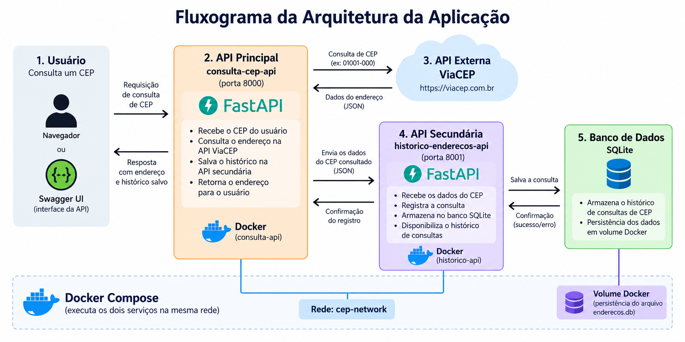

# API Consulta CEP + Histórico de Endereços

Projeto desenvolvido em Python com FastAPI, composto por duas APIs REST integradas através do Docker.

A aplicação permite consultar endereços a partir de um CEP utilizando a API externa ViaCEP e armazenar automaticamente as consultas realizadas em um histórico persistente.

---

## Sobre o projeto

O sistema é composto por dois serviços independentes:

### API Principal — Consulta CEP

Responsável por receber as solicitações do usuário, consultar o CEP através da API externa ViaCEP e enviar o endereço obtido para a API de histórico.

**Porta:** `8000`

### API Secundária — Histórico de Endereços

Responsável pelo armazenamento e gerenciamento dos endereços consultados.

Disponibiliza operações para cadastrar, consultar, atualizar e excluir registros do histórico.

**Porta:** `8001`

Os dados são armazenados em um banco SQLite com persistência através de um volume Docker.

---

## Arquitetura da aplicação

A aplicação utiliza uma arquitetura composta por duas APIs REST.

O usuário realiza a consulta através da API principal. A API principal consulta o serviço externo ViaCEP e, após obter os dados do endereço, envia essas informações para a API secundária.

A API secundária registra os dados em um banco SQLite, cujo arquivo é armazenado em um volume Docker para garantir a persistência das informações.



### Fluxo da aplicação

```text
Usuário / Swagger
        |
        v
API Principal - Consulta CEP
FastAPI - Porta 8000
        |
        +------> API externa ViaCEP
        |              |
        |<-------------+
        |       Dados do endereço
        |
        v
API Secundária - Histórico
FastAPI - Porta 8001
        |
        v
Banco de Dados SQLite
        |
        v
Volume Docker
```

As duas APIs são executadas em contêineres Docker e se comunicam através da rede `cep-network`.

---

## Tecnologias utilizadas

- Python
- FastAPI
- Uvicorn
- SQLite
- Docker
- Docker Compose
- Swagger / OpenAPI
- ViaCEP

---

## API externa — ViaCEP

A aplicação utiliza o **ViaCEP**, serviço público utilizado para consultar endereços a partir de CEPs brasileiros.

**Serviço:** ViaCEP  
**Site oficial:** https://viacep.com.br/  
**Cadastro:** não é necessário  
**Custo:** gratuito  
**Formato utilizado:** JSON

### Rota utilizada

```text
GET https://viacep.com.br/ws/{cep}/json/
```

Exemplo:

```text
GET https://viacep.com.br/ws/04007004/json/
```

A aplicação não redireciona o usuário para o ViaCEP. A API principal realiza a requisição ao serviço externo, recebe os dados em JSON, trata as informações e retorna o resultado dentro da própria aplicação.

Quando o CEP é encontrado, os dados também são enviados automaticamente para a API secundária e armazenados no histórico.

---

## Repositórios

O projeto é dividido em dois componentes independentes.

### API Principal

```text
consulta-cep-api
```

Contém a API responsável pela consulta de CEP e também o arquivo `docker-compose.yml`, utilizado para executar toda a aplicação.

### API Secundária

```text
historico-enderecos-api
```

Contém a API responsável pelo gerenciamento e persistência do histórico.

Para executar o projeto com Docker Compose, mantenha os dois repositórios em pastas lado a lado:

```text
projeto/
│
├── consulta-cep-api/
│   ├── app.py
│   ├── Dockerfile
│   ├── docker-compose.yml
│   ├── requirements.txt
│   ├── README.md
│   └── docs/
│       └── arquitetura-aplicacao.png
│
└── historico-enderecos-api/
    ├── app.py
    ├── database.py
    ├── Dockerfile
    ├── requirements.txt
    └── README.md
```

---

## Instalação e execução

### Pré-requisitos

Para executar a aplicação é necessário ter instalado:

- Git
- Docker
- Docker Compose

O Docker Desktop pode ser utilizado em ambientes Windows.

### 1. Clonar os repositórios

Clone os dois repositórios dentro da mesma pasta:

```bash
git clone https://github.com/jkeszek/consulta-cep-api.git
git clone https://github.com/jkeszek/historico-enderecos-api.git
```

A estrutura deverá ficar semelhante a:

```text
projeto/
├── consulta-cep-api/
└── historico-enderecos-api/
```

### 2. Acessar a API principal

```bash
cd consulta-cep-api
```

### 3. Iniciar os serviços

Com o Docker em execução:

```bash
docker compose up --build -d
```

O Docker Compose realizará a construção e inicialização das duas APIs.

### 4. Verificar os contêineres

```bash
docker compose ps
```

Os serviços `consulta-api` e `historico-api` deverão aparecer em execução.

### 5. Encerrar os serviços

```bash
docker compose down
```

> O volume do banco de dados é mantido ao executar `docker compose down`, preservando o histórico de endereços.

---

## Documentação Swagger

Com os contêineres em execução, a documentação interativa das APIs pode ser acessada pelo navegador.

### API Principal — Consulta CEP

```text
http://127.0.0.1:8000/docs
```

### API Secundária — Histórico

```text
http://127.0.0.1:8001/docs
```

O Swagger permite visualizar e testar as rotas diretamente pelo navegador.

---

## Principais endpoints

### Consultar CEP

```text
GET /cep/{cep}
```

Consulta o endereço correspondente ao CEP através do ViaCEP e salva automaticamente o resultado no histórico.

Exemplo:

```text
GET /cep/04007004
```

---

### Listar histórico

```text
GET /historico
```

Retorna os endereços armazenados no histórico.

---

### Adicionar endereço

```text
POST /historico
```

Adiciona manualmente um endereço ao histórico.

---

### Atualizar endereço

```text
PUT /historico/{id}
```

Atualiza um endereço existente utilizando seu identificador.

---

### Excluir endereço

```text
DELETE /historico/{id}
```

Remove um endereço do histórico utilizando seu identificador.

---

## Persistência dos dados

A API de histórico utiliza um banco de dados SQLite.

O Docker Compose utiliza o volume:

```text
historico-dados
```

Dentro do contêiner, o banco é armazenado em:

```text
/app/data/enderecos.db
```

A variável de ambiente utilizada pela API é:

```text
DATABASE_NAME=/app/data/enderecos.db
```

Dessa forma, os registros permanecem armazenados mesmo quando os contêineres são removidos e recriados com:

```bash
docker compose down
docker compose up -d
```

---

## Serviços Docker

| Serviço | Contêiner | Porta |
|---|---|---:|
| API Consulta CEP | `consulta-api` | `8000` |
| API Histórico | `historico-api` | `8001` |

Os serviços se comunicam através da rede Docker:

```text
cep-network
```

O arquivo `docker-compose.yml` está localizado na raiz do repositório da API principal.

---

## Funcionalidades

- Consulta de endereços através de CEP
- Integração com a API pública ViaCEP
- Tratamento dos dados recebidos da API externa
- Armazenamento automático das consultas
- Listagem do histórico
- Cadastro manual de endereços
- Atualização de registros
- Exclusão de registros
- Comunicação entre duas APIs REST
- Banco de dados SQLite
- Persistência de dados com Docker Volume
- Comunicação entre contêineres através de rede Docker
- Documentação automática com Swagger/OpenAPI
- Execução integrada dos serviços com Docker Compose